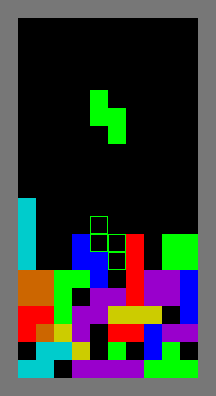

# Tetris

Classic Tetris clone made with C++ and SFML.

 Uses bit patterns for board and tetromino representation

Statically linked Windows executable available in the [bin](bin/) folder

## Input

|Command|Action|
|---|---|
|**Up Arrow**|Rotate|
|**Left Arrow**|Move Left|
|**Right Arrow**|Move Right|
|**Down Arrow**|Move down|
|**Space**|Drop|
|**Enter**|Pause/Unpause|
 
## Compiling the project yourself
The Visual Studio Project uses statically linked SFML 2.5.1 (64-bit) libraries and the SFML 2.5.1 (64-bit) include directory.

No SFML lib or dll files are provided at this time, you must acquire them yourself and link when compiling.

## Compilation options

All options can be found in the Tetris.vcxproj file.

- Additional include directories: SMFL-2.5.1(64-bit)\include
- Preprocessor definitions: SFML_STATIC (if using static linking)
- Additional library directories: SFML-2.5.1(64-bit)\lib

### Additional dependencies:
- winmm.lib
- opengl32.lib
- freetype.lib
- sfml-graphics-s.lib
- sfml-window-s.lib
- sfml-system-s.lib
- sfml-audio-s.lib
- kernel32.lib
- user32.lib
- gdi32.lib
- winspool.lib
- comdlg32.lib
- advapi32.lib
- shell32.lib
- ole32.lib
- oleaut32.lib
- uuid.lib
- odbc32.lib
- odbccp32.lib